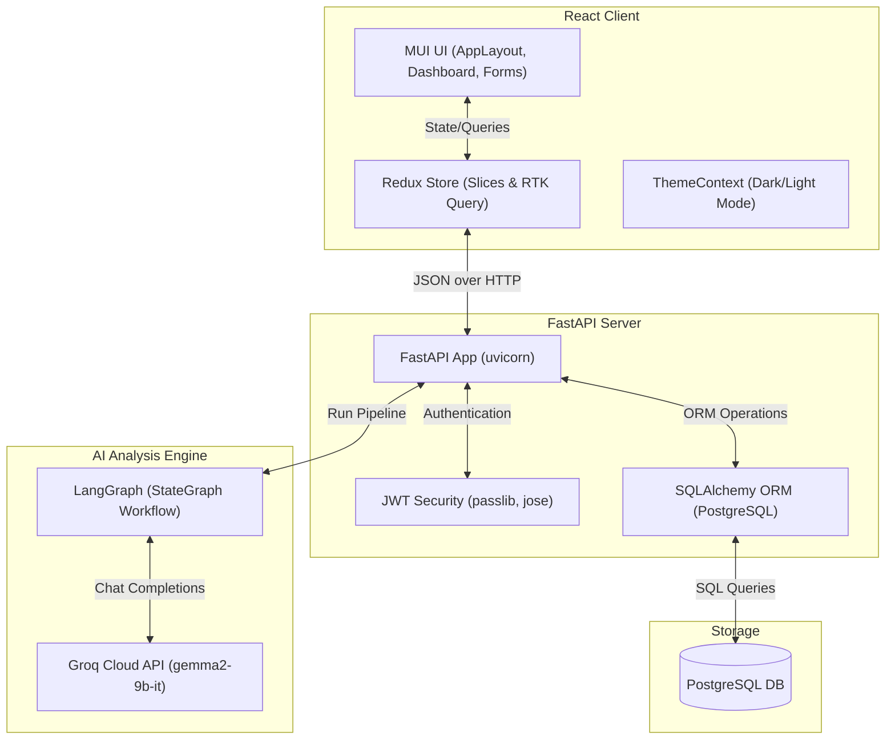
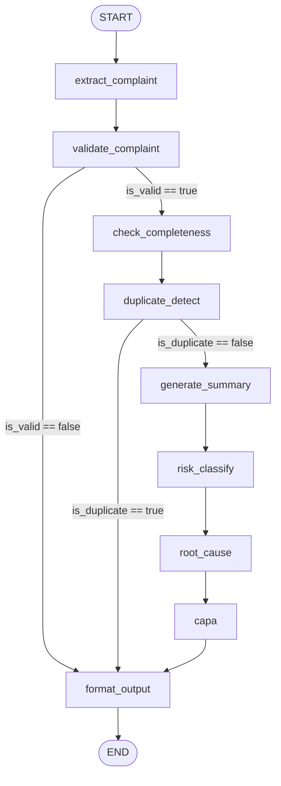

# AI-Powered Complaint Management System

An enterprise-grade Pharma/Medical Complaint Management System built with **React**, **FastAPI**, **PostgreSQL**, and an advanced agentic AI analysis pipeline orchestrated via **LangGraph** using **Groq** (`gemma2-9b-it`).

This system automates the ingestion, validation, completeness evaluation, duplicate detection, risk classification, root-cause analysis (RCA), and Corrective and Preventive Action (CAPA) generation for customer complaints.

---

## 🏛️ System Architecture



---

## 📂 Folder Structure

```
aivoa-complaint-system/
├── backend/
│   ├── alembic/                # DB migration environment
│   ├── app/
│   │   ├── ai/                 # LangGraph Pipeline
│   │   │   ├── agents/         # LLM wrapper classes/configurations
│   │   │   ├── nodes/          # Pipeline node definitions (extract, validate, etc.)
│   │   │   ├── tools/          # Schema definitions or utility functions for agents
│   │   │   ├── graph.py        # Pipeline StateGraph layout and compilation
│   │   │   ├── prompts.py      # LLM prompts for pipeline nodes
│   │   │   ├── prompts_copilot.py # Prompts for real-time form filler Copilot
│   │   │   └── state.py        # TypedDict defining LangGraph state variables
│   │   ├── api/                # API router entrypoints
│   │   │   └── v1/
│   │   │       └── routers/    # Sub-routers (auth, complaints, upload, ai)
│   │   ├── application/        # Business logic services
│   │   ├── core/               # App configuration and security definitions
│   │   ├── db/                 # DB connection and SQLAlchemy base model setup
│   │   ├── domain/             # Domain logic
│   │   │   ├── models/         # SQLAlchemy models (User, Complaint, AIAnalysis, etc.)
│   │   │   └── schemas/        # Pydantic validation schemas
│   │   ├── infrastructure/     # Repositories and external service clients
│   │   └── main.py             # FastAPI entrypoint file
│   ├── Dockerfile
│   ├── entrypoint.sh           # Runs DB migrations & starts backend
│   └── requirements.txt
├── frontend/
│   ├── public/                 # Static assets
│   ├── src/
│   │   ├── app/                # Redux store, themes, and slices (loading, toast)
│   │   ├── features/           # Business feature pages
│   │   │   ├── auth/           # Login / authentication components
│   │   │   ├── complaints/     # Forms, lists, detail views, and timeline components
│   │   │   └── dashboard/      # Stat cards, breakdown charts, and recent items
│   │   ├── shared/             # Global components, hooks, types, and utils
│   │   │   ├── components/     # AppLayout, ConfirmDialog, ErrorBoundary, GlobalLoader
│   │   │   ├── constants/      # Shared constant definitions (category colors)
│   │   │   ├── hooks/          # Global React hooks (useToast, useFileUpload)
│   │   │   └── types/          # Global TypeScript interfaces
│   │   ├── App.tsx             # Root routing, ErrorBoundary & Toast containers
│   │   └── main.tsx            # DOM initialization & provider bootstrapping
│   ├── Dockerfile
│   ├── package.json
│   ├── tsconfig.json           # Compiler rules (Vite and Node client references)
│   └── vite.config.ts          # Vite build tool config
├── docker-compose.yml          # Full-stack orchestrator
└── .env.example                # Template configuration settings
```

---

## 🤖 LangGraph AI Workflow

The AI Analysis Pipeline is structured as an acyclic state graph using **LangGraph**. The workflow evaluates, categorizes, and audits complaints to help compliance agents process them efficiently.



### Key Design & Routing Decisions
- **Compiled Once**: The StateGraph is compiled at the module level in [graph.py](file:///e:/aivoa-complaint-system/backend/app/ai/graph.py). Graph compilation is expensive; compiling it once allows request-level invocations to run instantly.
- **Partial State Updates**: Each node operates on a shared state (`ComplaintState`) defined in [state.py](file:///e:/aivoa-complaint-system/backend/app/ai/state.py) and returns only its updated keys. LangGraph merges these updates into the central state.
- **Conditional Routing**:
  - `_route_after_validate`: If a complaint is flagged as invalid (e.g. spam, gibberish), the pipeline skips completeness, duplicate checks, and analysis, routing directly to `format_output` to minimize LLM token usage and execution latency.
  - `_route_after_duplicate`: If the input matches a recent complaint, the pipeline flags the duplicate and skips risk, RCA, and CAPA, linking it to the original ticket.
- **Error Accumulation**: An `errors` list annotated with `operator.add` aggregates exceptions across nodes without breaking the workflow, ensuring the final formatter can log and display issues gracefully.

---

## 🗄️ Database Schema

```
                  ┌─────────────────┐
                  │      users      │
                  └────────┬────────┘
                           │ 1
                           │
                           │ 1..* (Created / Assigned)
                           ▼
                  ┌─────────────────┐
                  │   complaints    │
                  └────────┬────────┘
                           │
         ┌─────────────────┼─────────────────┐
         │ 1               │ 1               │ 1
         ▼                 ▼                 ▼
┌─────────────────┐ ┌───────────────┐ ┌───────────────┐
│   ai_analysis   │ │  documents    │ │   timeline    │
└─────────────────┘ └───────────────┘ └───────────────┘
```

The database is built on **PostgreSQL** with the following table definitions managed via SQLAlchemy:

### 1. `users` Table
Stores authentication and profile information.
- `id` (VARCHAR(36), PK): UUID of the user.
- `email` (VARCHAR(255), Unique, Indexed): User email address.
- `full_name` (VARCHAR(255)): Full name of the user.
- `hashed_password` (VARCHAR(255)): Hashed user password.
- `role` (ENUM('admin', 'agent', 'customer')): Determines user access controls.
- `is_active` (BOOLEAN): Activity flag.
- **Index**: `ix_users_email_active` on `(email, is_active)` for fast authentication queries.

### 2. `complaints` Table
Stores raw customer complaints and metadata.
- `id` (VARCHAR(36), PK): UUID of the complaint.
- `user_id` (VARCHAR(36), FK -> `users.id`): Creator of the complaint.
- `title` (VARCHAR(500)): Extracted title.
- `description` (TEXT): Core text description.
- `status` (ENUM('open', 'in_progress', 'resolved', 'closed')): Life-cycle status.
- `priority` (ENUM('low', 'medium', 'high', 'critical')): Severity priority.
- `category` (ENUM('billing', 'technical', 'service', 'product', 'other')): Categorization.
- `assigned_agent_id` (VARCHAR(36), FK -> `users.id`, Nullable): Agent working on the ticket.
- `resolution_notes` (TEXT, Nullable): Notes logged upon closing the ticket.
- **Indexes**:
  - `ix_complaints_user_id` on `user_id`
  - `ix_complaints_status` on `status`
  - `ix_complaints_status_priority` on `(status, priority)`
  - `ix_complaints_assigned_agent` on `assigned_agent_id`

### 3. `ai_analysis` Table
Stores structured AI pipeline analysis.
- `id` (VARCHAR(36), PK): UUID.
- `complaint_id` (VARCHAR(36), FK -> `complaints.id`, Unique): Links back to the complaint.
- `sentiment` (VARCHAR(50)): Overall sentiment classification.
- `sentiment_score` (FLOAT): Numerical sentiment score (0.0 to 1.0).
- `suggested_category` (VARCHAR(100)): AI classification suggestion.
- `suggested_priority` (VARCHAR(50)): AI priority suggestion.
- `summary` (TEXT): High-level summary of the issue.
- `suggested_response` (TEXT): Draft agent email/response to the customer.
- `raw_output` (JSON): The full JSON output returned by the LangGraph pipeline.

### 4. `complaint_documents` Table
Stores uploaded attachments and documents.
- `id` (VARCHAR(36), PK): UUID.
- `complaint_id` (VARCHAR(36), FK -> `complaints.id`): Associated complaint.
- `file_name` (VARCHAR(500)): Original file name.
- `file_path` (VARCHAR(1000)): Local file path on disk.
- `file_size` (INTEGER): File size in bytes.
- `mime_type` (VARCHAR(100)): Media type (PDF, image, txt, etc.).
- `uploaded_by` (VARCHAR(36), FK -> `users.id`): User who uploaded it.

### 5. `complaint_timeline` Table
Logs complaint audit history.
- `id` (VARCHAR(36), PK): UUID.
- `complaint_id` (VARCHAR(36), FK -> `complaints.id`): Associated complaint.
- `actor_id` (VARCHAR(36), FK -> `users.id`): Agent or system who triggered the change.
- `event_type` (VARCHAR(100)): Type of action (`created`, `status_change`, `file_upload`).
- `description` (TEXT): Readable activity description.
- `previous_value` (VARCHAR(100), Nullable): Old attribute value.
- `new_value` (VARCHAR(100), Nullable): New attribute value.

---

## 📡 API Documentation

### 🔓 Authentication
- `POST /api/v1/auth/register`: Create a new user.
- `POST /api/v1/auth/token`: OAuth2 password flow, returns JWT token.
- `GET /api/v1/auth/me`: Get info about current authenticated user.

### 📋 Complaints
- `GET /api/v1/complaints`: List complaints. Supports filtering (`status`, `priority`, `category`) and pagination.
- `POST /api/v1/complaints`: Create a complaint.
- `GET /api/v1/complaints/{id}`: Retrieve a specific complaint.
- `PUT /api/v1/complaints/{id}`: Update a complaint (status, priority, resolution notes).
- `DELETE /api/v1/complaints/{id}`: Delete a complaint.
- `GET /api/v1/complaints/{id}/timeline`: Retrieve audit timeline for a complaint.

### 📁 Uploads & Documents
- `POST /api/v1/complaints/{id}/upload`: Attach a document (PDF, PNG, JPG, MSG, TXT) to the complaint.
- `GET /api/v1/complaints/{id}/documents`: List attached documents.
- `DELETE /api/v1/complaints/{id}/documents/{doc_id}`: Delete an attachment.
- `GET /api/v1/complaints/{id}/documents/{doc_id}/download`: Download attachment.

### 🤖 AI Pipeline
- `POST /api/v1/ai/copilot/extract`: Real-time text extraction (fills form fields during patient interviews).
- `POST /api/v1/ai/pipeline/run`: Run the full LangGraph pipeline on a complaint.
- `GET /api/v1/complaints/{id}/ai-analysis`: Retrieve AI analysis result for a complaint.

---

## ⚙️ Environment Variables

Copy `.env.example` to `.env` and fill in:
```ini
# Database (Docker settings)
POSTGRES_USER=aivoa_user
POSTGRES_PASSWORD=aivoa_pass
POSTGRES_DB=aivoa_complaints
POSTGRES_HOST=db
POSTGRES_PORT=5432
DATABASE_URL=postgresql://aivoa_user:aivoa_pass@db:5432/aivoa_complaints

# Backend Authentication
SECRET_KEY=generate-a-secure-random-key-for-prod
ALGORITHM=HS256
ACCESS_TOKEN_EXPIRE_MINUTES=60
BACKEND_CORS_ORIGINS=http://localhost:3000

# Groq Configuration
GROQ_API_KEY=gsk_your_groq_api_key_goes_here
GROQ_MODEL=gemma2-9b-it

# Frontend Client
VITE_API_BASE_URL=http://localhost:8000/api/v1
```

---

## 🚀 Setup & Installation Guide

### Prerequisites
- Docker & Docker Compose
- Node.js v20 (for host execution)
- Python 3.12 (for host execution)

### Option 1: Docker Compose (Recommended)
This runs the Frontend, Backend, and PostgreSQL database automatically.

1. **Clone and Navigate to Project Root**:
   ```bash
   cd aivoa-complaint-system
   ```
2. **Setup environment variables**:
   ```bash
   cp .env.example .env
   # Add your GROQ_API_KEY inside the .env file
   ```
3. **Build and Run services**:
   ```bash
   docker-compose up --build
   ```
4. **Access the application**:
   - Frontend: [http://localhost:3000](http://localhost:3000)
   - Backend Docs: [http://localhost:8000/docs](http://localhost:8000/docs)

### Option 2: Host Execution (Local Dev)
If you want to run the services directly on your host machines.

#### 1. Database Setup
Ensure PostgreSQL is running on port 5432 and matching your `.env` settings.

#### 2. Backend Setup
1. Navigate to `/backend`:
   ```bash
   cd backend
   ```
2. Create and activate a virtual environment:
   ```bash
   python -m venv venv
   source venv/bin/activate  # On Windows: venv\Scripts\activate
   ```
3. Install dependencies:
   ```bash
   pip install -r requirements.txt
   ```
4. Run DB migrations:
   ```bash
   alembic upgrade head
   ```
5. Start FastAPI application:
   ```bash
   uvicorn app.main:app --host 0.0.0.0 --port 8000 --reload
   ```

#### 3. Frontend Setup
1. Navigate to `/frontend`:
   ```bash
   cd ../frontend
   ```
2. Install dependencies:
   ```bash
   npm install
   ```
3. Start dev server:
   ```bash
   npm run dev
   ```

---

## ⚡ Groq & AI Setup
1. Create a free account at [Groq Cloud Console](https://console.groq.com).
2. Generate a new API Key.
3. Paste the key into your `.env` file under `GROQ_API_KEY`.
4. The system is optimized for `gemma2-9b-it` due to its high performance and speed. If you wish to use larger models like `llama3-70b-8192`, update the `GROQ_MODEL` setting in `.env`.

---

## 🎙️ AI Copilot & Patient Interview Application
When agents are conducting phone or chat interviews with patients/customers, they can copy the raw text conversation and paste it into the **AI Copilot** panel inside the *New Complaint* screen:
- **Feature Extraction**: Instantly parses names, drugs, lot numbers, batch details, manufacturing/expiry dates, and descriptions.
- **Automated Fill**: Auto-populates the React form fields.
- **Confidence Highlights**: Visual indicators highlight fields filled by the AI in blue, complete with tooltips showing confidence ratings. If an agent manually edits any auto-filled value, the AI indicator clears to avoid confirmation bias.
- **RCA and CAPA Insights**: Instantly drafts standard Corrective Actions and Root Cause analysis for review.

---

## 🌐 Production Deployment Guide
1. **Secrets Security**: Change the `SECRET_KEY` env variable using a cryptographically secure string (e.g. `openssl rand -hex 32`).
2. **Turn off reload in FastAPI**: In production, launch Uvicorn without `--reload` and run with multiple worker processes:
   ```bash
   uvicorn app.main:app --host 0.0.0.0 --port 8000 --workers 4
   ```
3. **Database Backups**: Schedule automated snapshot backups for the PostgreSQL Docker volume.
4. **Proxy**: Bind Uvicorn behind Nginx or an AWS Application Load Balancer to handle SSL certificates (HTTPS) and rate limiting.
